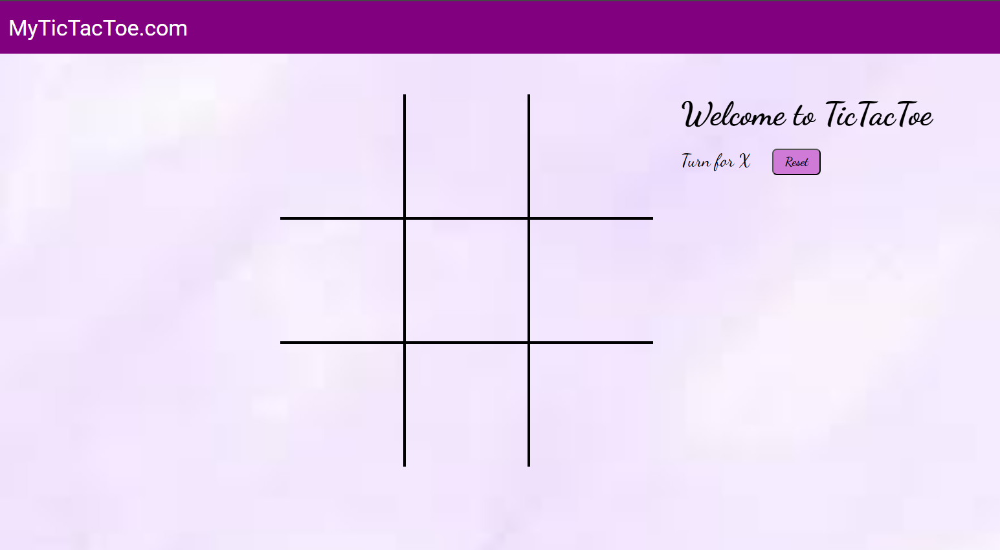

# Tic-Tac-Toe Game 🎮

A simple and interactive **Tic-Tac-Toe** game built with HTML, CSS, and JavaScript. The game allows two players to play on the same device, taking turns, and it clearly shows whose turn it is at each step.

## 🔥 Features

- 🎯 **Two-Player Gameplay**: Classic 3x3 grid where two players take turns.
- 👀 **Turn Indication**: Clearly displays which player's turn it is (X or O).
- 🎉 **Win Detection**: Automatically highlights the winning combination and announces the winner.
- 🔁 **Reset Button**: Easily restart the game with a single click

## 🛠 Technologies Used

- **HTML** – for game layout and structure  
- **CSS** – for styling and layout  
- **JavaScript** – for game logic and interactivity  

## 🚀 Getting Started

1. Clone this repository:
   
bash
   git clone https://github.com/ujeer/Beginner-Project.git
2.  Navigate to the Tic-Tac-Toe folder:
sh
   cd Beginner-Project/tictactoe
   
3. Open the `index.html` file in your browser.

📸 Screenshot

## 📺 YouTube Reference

This project was inspired by the following tutorial:  
👉 [Watch on YouTube](https://youtu.be/sSLGP-_2gOI?si=PqI3kZ9ooGvdxN-s)